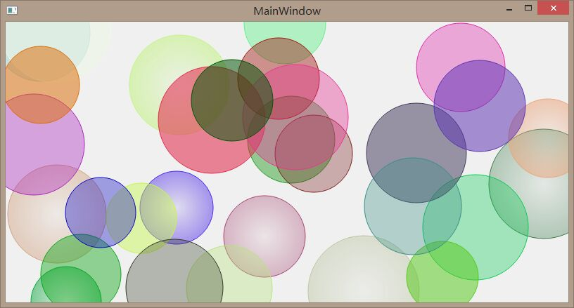

七彩的泡泡
------------

**Date**: 2015.07.19 
**Author**: HAQ 
**Principal**: HAQ

####限制条件：

 - **难度**：N/A
 - **限定语言**：C++ 
 - **人数限制**：1
 - **依赖任务**：N/A

####任务描述：

 - **简介**：QT第一课！大家都见过满屏晃动的泡泡的屏保吧，我们现在就来做一个它基本的雏形吧，在主窗体上绘制一幅七彩泡泡的画面。
 
 - **需求**：
	1. 要求泡泡的数量大于20个，位置随机
	2. 泡泡的*大小*、*颜色*随机，需要有各自的*透明度*，一些泡泡需要设定为*渐变色*
	3. 这是一个参考的示例图：
	4. 提示：可以通过重写`QMainWindow`的成员函数`paintEvent`来实现
	5. 符合*代码规范*：[RobitCppCodingConventions](ref/RobitCppCodingConventions.md)

 - **关键词**：`QPainter`、`QPaintEvent`、`QPen`、`QBrush`、`qrand()`
 - **参考资料**：[RGB颜色对照表](http://tool.oschina.net/commons?type=3)

 