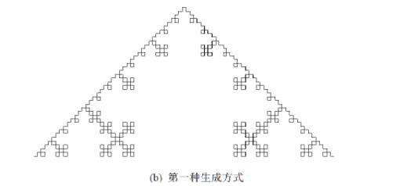

Simple Koch Curve
------------

**Date**: 2015.07.20
**Author**: WX
**Principal**: WX

####限制条件：

 - **难度**：N/A
 - **限定语言**：C++ 
 - **人数限制**：1
 - **依赖任务**：[ColorfulBubbles](ColorfulBubbles.md)

####任务描述：

 - **简介**：客观自然界中许多事物，具有自相似的“层次”结构，在理想情况下，甚至具有无穷层次。适当的放大或缩小事物的几何尺寸，整个结构并不改变。如连绵的山川、漂浮的云朵、岩石的断裂口、粒子的布朗运动、树冠、花菜、大脑皮层。。。这些部分与整体以某种方式想似的形体称为分形。Koch Curve是分形算法最基本的应用，大家一起来做一个简单的变式科赫曲线吧。
 
 
 - **需求**：
	1. 要求科赫曲线的初始状态是一个正方形
	2. 取每边中间的三分之一，接上去一个形状完全相似的但边长为其三分之一的正方形
	3. 接下来每个边做同样的变换，要求迭代次数不少于5次
	4. 提示：可以通过重写`QMainWindow`的成员函数`paintEvent`来实现
	5. 符合*代码规范*：[RobitCppCodingConventions](ref/RobitCppCodingConventions.md)

 - **关键词**：`QPainter`、`QPaintEvent`、`QPen`
 - **参考资料**：
 	- [经典的分形算法](http://www.douban.com/note/230496472/)
 	- [科赫曲线](http://baike.baidu.com/view/390109.htm)

 