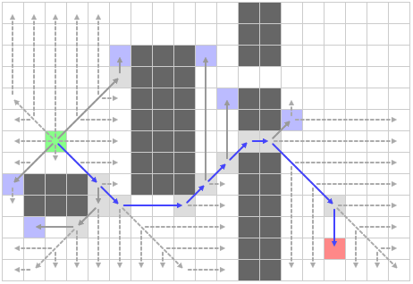

寻路算法竞技场
---

**Date**: 2015.08.1
**Author**: MYLS
**Principal**: MYLS

####限制条件：

 - **难度**：4
 - **限定语言**：N/A
 - **人数限制**：[2, 3]
 - **依赖任务**：N/A

####任务描述：

 - **简介**：昂，有时候，我们需要学习、实现、测试、调试、对比多种算法。比如测试多种寻路算法，如果依靠单元测试，会非常缺乏可视化和变化性。

 我们觉得有必要实现一个测试寻路算法的平台。

 - **需求**：
    1. 程序为一个带任意图形界面和必要按钮的程序，UI 细节自定
    2. 实际效果请参考**参考资料**一项 以及 简介中给出的图
    3. 程序分为两个部分，用于交互的 *GUI* 界面，以及*寻路算法模块*。两部分不限定是否采用内嵌代码，动态链接库或者静态链接库的方式，但是请保证*可拓展性*和*接口清晰*。
    4. 可视化测试的时候，寻路过程的每一步都需要动态显示，且能设定为单步运行的方式
    5. 支持统计**实际**运行时间、内存占用等数据
    6. 如果(小组人数 == 2)那么需要预设 3 个不同寻路算法，否则需要预设 5 个不同寻路算法
    7. 建议：预先设计好各个模块再编码，分工明确
    8. 符合*代码规范*：[RobitCppCodingConventions](ref/RobitCppCodingConventions.md)

 - **关键词**：`Heuristic search`, `State Space Search`, `GUI`
 - **参考资料**：
 	- [PathFinding](http://qiao.github.io/PathFinding.js/visual/)
 	- [Jump Point Search Explained](http://zerowidth.com/2013/05/05/jump-point-search-explained.html)

