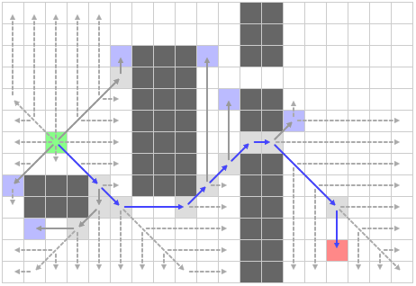

寻路算法竞技场
---

**Date**: 2015.08.1
**Author**: MYLS
**Principal**: MYLS

####限制条件：

 - **难度**：4
 - **限定语言**：N/A
 - **人数限制**：[2, 3]
 - **依赖任务**：N/A

####任务描述：

 - **简介**：昂，有时候，我们需要学习、实现、测试、调试、对比多种算法。比如测试多种寻路算法，如果依靠单元测试，会非常缺乏可视化和变化性。

 我们觉得有必要实现一个测试寻路算法的平台。

 - **需求**：
    1. 原创一个带**任意图形界面**和必要交互按钮的程序，其它 UI 细节自定
    2. 实际效果请参考**参考资料**中[PathFinding](http://qiao.github.io/PathFinding.js/visual/)一项 以及 简介中给出的图片
    3. 程序分为两个部分，用于交互的 **GUI** 界面，以及**寻路算法模块**，后者限定使用 C++ 编写。不限定采用内嵌代码，动态链接库或者静态链接库的方式，但是请保证**可拓展性**和**接口清晰**
    4. 可视化测试的时候，寻路过程的每一步都需要显示出，且能设定为**单步运行**的方式
    5. 支持统计**实际**运行时间、内存占用等数据
    6. 如果(小组人数 == 2)
    	- 那么，需要预设 3 个不同寻路算法（BFS, DFS, A*），
    	- 否则，需要预设 6 个不同寻路算法（BFS, DFS, Dijkstra, A*, Jump Point Search, Potential Field）
    7. 建议：预先设计好各个模块再编码，分工明确
    8. 符合*代码规范*：[RobitCppCodingConventions](ref/RobitCppCodingConventions.md)

 - **关键词**：`Heuristic search`, `State Space Search`, `GUI`
 - **参考资料**：
 	- [PathFinding](http://qiao.github.io/PathFinding.js/visual/)
 	- [Jump Point Search Explained](http://zerowidth.com/2013/05/05/jump-point-search-explained.html)
 	- [即时战略游戏中实用的寻路算法都有哪些，比较如何？](http://www.zhihu.com/question/20298134)
 	- [寻路算法实践2](http://blog.csdn.net/stevenkylelee/article/details/7246138)

