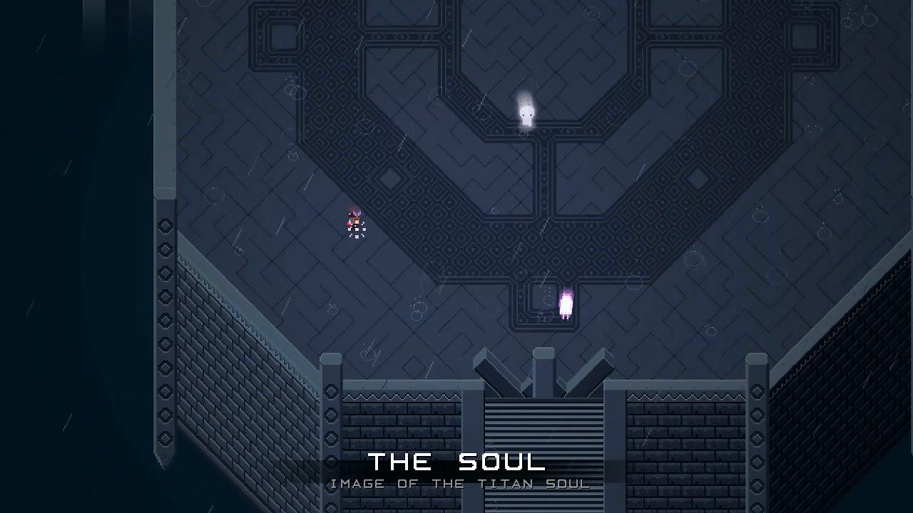

Your Soul
---

**Date**: 2015.07.23
**Author**: MYLS
**Principal**: MYLS

####限制条件：

 - **难度**：4
 - **限定语言**：N/A
 - **人数限制**：[2, 3]
 - **依赖任务**：N/A

####任务描述：

 - **简介**：大作业，其一。最近 MYLS 同学玩上了一个很硬核的独立游戏，Titan Souls。具体细节可以无视，总之有一个场景，就是和你自己的加强版——`The Soul`的战斗……
 
 然而加强的敌人在技能上的强大，只是掩盖了智能上的不足。所以还是自己动手创造一个，和自己在同等条件，能打败自己的AI吧！

 - **需求**：
    1. 程序为一个带任意图形界面的游戏[PC 平台]
    2. 为**俯视**视角，**即时**战斗模式，画面2D\3D不限
    3. 自定**场景**，保持自己和AI两个**等价**的角色公平竞争
    4. 自定**角色技能**、**操作方式**、**胜利条件**，请保证具有**竞技性**，**可玩性**
    5. AI 应有较高的应变能力，没有明显逻辑弱点
    6. 推荐：
    	- 预先设计好各个模块再编码
    	- 分工明确，例如：UI、逻辑程序、AI
    7. 推荐自己动手写出程序框架，结合 QT 等可视化显示。或者你也可以使用别人的游戏框架\引擎，例如`SDL`, `libGDX`, `Cocos2d-x`, `Construct 2`等等，暂不建议使用高度可视化的引擎。
    8. **选做**，
    	- 包含完整的主菜单页面
    	- 包含合适的音效
    	- 界面设计美观，合理
    9. 符合*代码规范*：[RobitCppCodingConventions](ref/RobitCppCodingConventions.md)，提交之前请补全必要注释。

 - **关键词**：`Titan Souls`, `The Binding of Isaac Rebirth`
 - **参考资料**：
 	- [专栏：Qt游戏开发](http://blog.csdn.net/column/details/qt-game.html)
 	- [常见游戏开发引擎列表](http://www.douban.com/group/topic/18401274/)
	- 教程：[国外经典像素画教程汇总](http://site.douban.com/163509/widget/notes/8695193/note/313513155/)
	- 资源：[爱给网-免费游戏素材](http://www.2gei.com/)
 	- 音乐资源：[フリーBGM・音楽素材MusMus](http://musmus.main.jp/)
 	- 图片资源：[共享素材推荐](http://www.nvlmaker.net/material.html)
 	- 图片素材：[站酷](http://www.zcool.com.cn/)
	- 图片素材：[PEXELS](http://www.pexels.com/)

